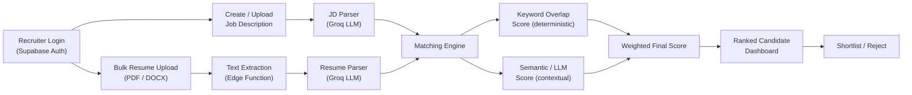

# Talent Matcher

# PRD — AI Resume Screening System

**Working name:** SkillMatch AI *(rename freely — used as a placeholder throughout)*

**Purpose of this doc:** Paste sections 5–11 directly into Lovable as build prompts (phased, per Section 13). Sections 1–4 and 12 are for your own reference / report.

---

## 1. Problem Statement

Recruiters receive large volumes of resumes per job opening. Manual screening is slow, inconsistent, and risks overlooking qualified candidates. SkillMatch AI automates the first pass: it ingests a Job Description (JD) and a batch of resumes, extracts structured candidate data, compares it against the JD using NLP/ML techniques, and produces a ranked, explainable shortlist — a decision-support tool, not an auto-reject system.

## 2. Goals & Success Criteria

| Goal | How it's measured |

|---|---|

| Cut manual screening time | Recruiter reviews a ranked list instead of every raw resume |

| Consistent, bias-reduced first pass | Every resume scored against the same rubric |

| Explainable scoring | Every score is backed by matched/missing skills + a written rationale, not a black-box number |

| Usable, demo-ready product | Full flow works end-to-end: JD in → resumes in → ranked list out |

## 3. Target User

Single recruiter/hiring-manager account (per your scope: one account, connected once). Design for one authenticated user managing multiple JDs and candidate pools — no team/multi-tenant complexity needed for v1.

## 4. Core User Flow

1. Recruiter logs in → creates a Job Description (paste text or upload file)

2. System parses the JD → extracts required skills, nice-to-have skills, experience level, education requirement

3. Recruiter bulk-uploads resumes (PDF/DOCX) against that JD

4. System extracts text → parses each resume into structured fields → runs the matching engine

5. Recruiter lands on a ranked candidate dashboard, sorted by match score, with matched/missing skills and an AI rationale per candidate

6. Recruiter shortlists/rejects candidates directly from the dashboard

---

## 5. Tech Stack

- **Frontend:** React + TypeScript + Tailwind CSS + shadcn/ui (Lovable defaults)

- **Animation:** Framer Motion for all transitions, layout animation, and count-up effects

- **Backend:** Supabase — Postgres (with Row Level Security), Auth (email/password, single user), Storage (resume files), Edge Functions (Deno) for all AI/parsing logic

- **AI/NLP engine:** Groq API (Llama 3.x models — check Groq's current model list for the latest recommended one, e.g. `llama-3.3-70b-versatile`) called **only from Edge Functions**, never from the client, using a `GROQ_API_KEY` Edge Function secret

- **File parsing:** `unpdf` (PDF → text) and `mammoth` (DOCX → text) inside Edge Functions, both importable via `esm.sh` in Deno

## 6. System Architecture



**Why a dual-score approach:** a pure LLM score is contextual but opaque; a pure keyword score is transparent but misses synonyms ("React" vs "React.js", "led a team" vs "leadership"). Combining both gives you a defensible score *and* a real NLP/ML technique to describe in your report — not just "asked an LLM for a number."

---

## 7. Database Schema (Supabase / Postgres)

```sql

-- Job Descriptions

create table job_descriptions (

  id uuid primary key default gen_random_uuid(),

  user_id uuid references auth.users(id) not null,

  title text not null,

  company text,

  raw_text text not null,

  required_skills text[] default '{}',

  preferred_skills text[] default '{}',

  min_experience_years numeric,

  education_requirement text,

  created_at timestamptz default now()

);

-- Candidates (one row per uploaded resume)

create table candidates (

  id uuid primary key default gen_random_uuid(),

  job_description_id uuid references job_descriptions(id) on delete cascade,

  user_id uuid references auth.users(id) not null,

  full_name text,

  email text,

  phone text,

  file_path text not null,          -- Supabase Storage path

  raw_text text,

  parsed_skills text[] default '{}',

  parsed_education jsonb,

  parsed_experience jsonb,

  total_experience_years numeric,

  status text default 'pending'

    check (status in ('pending','processing','analyzed','shortlisted','rejected','failed')),

  created_at timestamptz default now()

);

-- Match Results (one row per candidate x JD)

create table match_results (

  id uuid primary key default gen_random_uuid(),

  candidate_id uuid references candidates(id) on delete cascade,

  job_description_id uuid references job_descriptions(id) on delete cascade,

  overall_score numeric not null,

  keyword_score numeric,

  semantic_score numeric,

  matched_skills text[] default '{}',

  missing_skills text[] default '{}',

  ai_summary text,

  strengths text,

  concerns text,

  rank int,

  created_at timestamptz default now()

);

-- Storage bucket: "resumes" (private)

-- RLS

alter table job_descriptions enable row level security;

alter table candidates enable row level security;

alter table match_results enable row level security;

create policy "own jds" on job_descriptions

  for all using (auth.uid() = user_id);

create policy "own candidates" on candidates

  for all using (auth.uid() = user_id);

create policy "own match results" on match_results

  for all using (

    exists (select 1 from candidates c where c.id = candidate_id and c.user_id = auth.uid())

  );

```

---

## 8. Core Features & Functional Requirements

### 8.1 Authentication

- Supabase email/password auth, single recruiter account

- Clean, minimal login screen — no public sign-up flow needed

### 8.2 Job Description Management

- Create JD via pasted text **or** file upload (PDF/DOCX)

- Edge Function `parse-jd`: sends raw JD text to Groq, returns structured JSON — `required_skills`, `preferred_skills`, `min_experience_years`, `education_requirement`, `role_summary`

- JD list view (cards) + JD detail view showing the parsed breakdown before any resumes are uploaded, so the recruiter can sanity-check extraction

### 8.3 Resume Upload & Parsing

- Drag-and-drop multi-file upload (PDF/DOCX, max 5MB each, up to 20 at once) scoped to a specific JD

- Files go to Supabase Storage → `status: pending`

- Edge Function `extract-text`: pulls raw text from each file (`unpdf`/`mammoth`)

- Edge Function `parse-resume`: sends resume text to Groq, returns structured JSON — `full_name`, `email`, `phone`, `skills`, `education` (list of degree/institution/year), `experience` (list of role/company/duration/description), `total_experience_years`

- Per-file status tracking: `pending → processing → analyzed` (or `failed`, with a retry action)

### 8.4 AI Matching Engine

- Edge Function `analyze-match(candidate_id, job_description_id)`:

  1. Deterministic **keyword_score** = (matched required skills ÷ total required skills) × 100, computed in TypeScript — no API call

  2. LLM **semantic_score** — prompt Groq with both parsed JD and resume JSON, ask for: matched skills (incl. close synonyms), missing skills, a 0–100 contextual fit score, a 2–3 sentence rationale, one strength, one concern — **require strict JSON output**

  3. **overall_score** = `0.4 * keyword_score + 0.6 * semantic_score` (expose the weight as a constant so it's easy to tune/justify in your report)

  4. Write one row to `match_results`; recompute `rank` for that JD by `overall_score desc`

- Trigger: automatically on upload completion, plus a manual "Re-analyze" button per candidate

### 8.5 Candidate Ranking Dashboard

- Table/card view of all candidates for a JD, sorted by `overall_score` desc, with rank badge (#1, #2, ...)

- Each row: name, score (color-coded), top 3 matched skills as chips, status badge

- Filter by score range and by status; search by name; sort toggle

- Shortlist / Reject actions inline, updating `status`

### 8.6 Candidate Detail View

- Slide-over panel or modal: full parsed resume (skills, education, experience) side-by-side with JD requirements

- Matched skills (green chips) vs. missing skills (amber chips)

- AI rationale, strength, and concern shown as short text blocks

- Score breakdown: keyword score vs. semantic score vs. overall (small radial or bar visualization)

### 8.7 Dashboard Home (stretch, recommended)

- Overview cards: total JDs, total resumes screened, average score this week

- Recent activity list

---

## 9. UI/UX Design Requirements

### 9.1 Design System

- **Palette:** deep indigo/violet primary (`#4F46E5`-ish), neutral slate background, semantic score colors — emerald (high match ≥75), amber (medium 50–74), rose (low <50)

- **Typography:** Inter, clear size hierarchy, generous line height for resume text blocks

- **Cards:** soft shadow + 1px border, subtle hover elevation, rounded-xl

- **Dark mode:** supported via a toggle, using Tailwind's dark variant

### 9.2 Key Screens

1. Login

2. Dashboard home (stats overview)

3. Job Descriptions list → JD detail (parsed breakdown)

4. Resume upload (dropzone, per-JD)

5. Candidate ranking dashboard

6. Candidate detail panel

---

## 10. Animation & Micro-interaction Spec

Use Framer Motion throughout — this is the part Lovable needs explicit direction on:

- **Page/route transitions:** fade + 8px slide-up, ~200ms

- **Dropzone:** border pulses and background tints on drag-over; scale-up (1.02) on file drop

- **Upload progress:** smooth animated fill bar per file, checkmark pop-in on completion

- **AI processing state:** pulsing "analyzing…" indicator (animated dots or subtle gradient shimmer) shown per candidate while `status = processing`

- **Skeleton loaders:** shimmer placeholders for the dashboard and detail panel while data loads

- **Score reveal:** radial/circular progress ring that animates from 0 to the final score (count-up number in sync) when a candidate's analysis completes

- **Candidate list:** staggered entrance (fade + slide, ~40ms delay per row) on first load; when re-sorted, animate reordering with Framer Motion's `layout` prop rather than a hard re-render

- **Cards/buttons:** subtle scale (1.02) + shadow increase on hover; press state scales to 0.98

- **Status change (shortlist/reject):** color transition + small icon animation (checkmark or X) on the badge

- **Toasts:** slide in from top-right for upload success, analysis complete, and errors; auto-dismiss with a shrinking progress bar

---

## 11. Non-Functional Requirements

- File validation: PDF/DOCX only, 5MB max per file, clear inline error on rejection

- Graceful failure: a resume that fails parsing gets `status: failed` with a visible retry button, never a silent drop

- Responsive layout (mobile/tablet/desktop) — dashboard collapses to stacked cards below `md`

- Groq API key stored only as an Edge Function secret, never shipped to the client

- Loading and empty states designed for every screen (no blank white flashes)

---

## 12. Out of Scope for v1

Multi-recruiter/team accounts, ATS integrations, email notifications, non-English resumes, video resumes. Note these as "future enhancements" in your report if useful.

---

## 13. How to Build This in Lovable (recommended order)

Large one-shot prompts tend to produce shakier full-stack apps than a phased build. Suggested sequence, pasting the referenced sections each time:

1. **Scaffold + schema:** Paste Sections 5, 7, and 9.1 — "Set up this Supabase schema with RLS, and scaffold the app shell with this design system." Connect your Supabase project when Lovable prompts for it.

2. **Auth + JD management:** Paste Section 8.1 and 8.2 — build login and the JD create/list/detail screens.

3. **Resume upload + parsing:** Paste Section 8.3 — build the dropzone, storage wiring, and the `extract-text` / `parse-resume` Edge Functions. Add `GROQ_API_KEY` as an Edge Function secret at this step.

4. **Matching engine:** Paste Section 8.4 — build `analyze-match` and wire it to trigger after upload.

5. **Dashboard + detail view:** Paste Sections 8.5, 8.6, 8.7.

6. **Polish pass:** Paste Section 10 alone as a final prompt — "Add these animations across the existing screens" — this works better once components already exist than trying to bake animation into every earlier step.

Test each Edge Function's response shape (in Supabase's function logs) before wiring it to UI — LLM JSON output is the most common failure point, so add a `try/catch` with a fallback "needs manual review" status if Groq's response fails to parse.

This project was built with [Lovable](https://lovable.dev).

## Build with Lovable

Continue developing this project in the [Lovable editor](https://lovable.dev/projects/6d2a9458-e761-48a9-92d6-306387ec9dab).

- **Ship faster**: describe what you want to build and Lovable handles the code.
- **Stay in sync**: every change made in Lovable is committed straight to this repository.
- **Full ownership**: this code is yours. Push to `main` on GitHub and your changes sync back into Lovable, ready for your next prompt.

## Development

Prefer working locally? You need Node.js and npm — [install with nvm](https://github.com/nvm-sh/nvm#installing-and-updating).

```sh
git clone <this-repository-url>
cd <repository-name>
npm i
npm run dev
```
